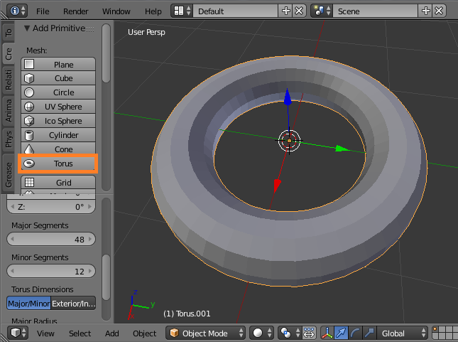
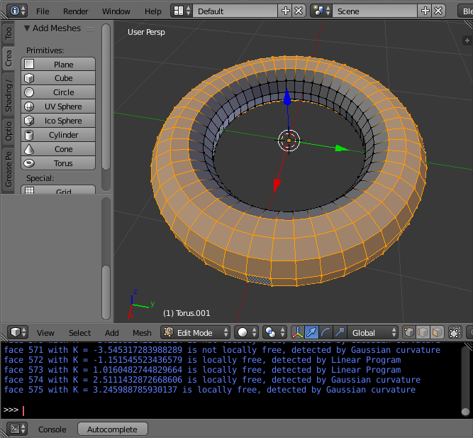

# Curvature and assembly of parallel meshes

The Python script `filofree.py` detects for a given conical mesh with convex faces in Blender whether the faces are locally free. It is part of my Master's thesis at TU Berlin were theoretical background about the topics _Curvature of parallel meshes_, _conical meshes_, their _assembly_ and especially _local freedom_ can be found. 

## Getting started

In order to execute the script, a [Python](https://www.python.org/) installation with [SciPy](https://www.scipy.org/) and a [Blender](https://www.blender.org/) installation are needed. Moreover, Blender must be set to use this Python installation that includes SciPy. You might want to have a look at the following external links that help you get the environment set up:

- [Using 3rd party Python modules](https://blender.stackexchange.com/questions/5287/using-3rd-party-python-modules)
- [Using Anaconda Python in Blender](https://blender.stackexchange.com/questions/51067/using-anaconda-python-3-in-blender-winx64) – If you choose to install SciPy with [Anaconda](https://www.continuum.io/downloads).

Then, of course, you need to download `filofree.py`.

## Usage

In Blender, design a mesh and make sure that it is _conical_. For example, a torus from Blender's _primitives_ list is a conical mesh.

Make sure the mesh is selected and run the script `filofree.py` from within Blender. You may consult the following link for help
- [Running Python script in Blender](https://stackoverflow.com/questions/11604548/running-python-script-in-blender)

In the case of success, the script selects all locally free faces and deselects all that are not locally free. Moreover, it prints for every face the Gaussian curvature, the local freedom and the way how it was detected, which is one of these three:

1. `it is a boundary face` – Boundary faces are only adjacent to at most three faces and thus always locally free.
2. `detected by Gaussian curvature` – The face is locally free if and only if its Gaussian curvature K is greater than 0 – provided that the Gauss-image is convex and non-degenerate.
3. `detected by Linear Program` – Fallback mode if the equivalence (2) cannot be applied. Local freedom is checked by testing whether the side-faces form an unbounded polytope.

## License

`filofree.py` is licensed under the MIT License, see [LICENSE](LICENSE).